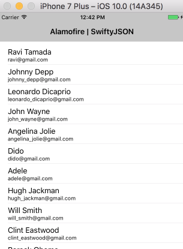

# Alamofire | SwiftyJSON Demo
My swift3 exercise for this [excellent tutorial][1] with some of my own changes.



## Setup CocoaPods
```sh
➜  sudo gem update --system
➜  sudo gem install cocoapods
➜  pod setup
➜  (Xcode8 create single view application)
➜  cd AlamofireSwiftyJSONDemo
➜  pod init
➜  open -a Xcode Podfile
➜  Make some changes here, see below
➜  pod install
Analyzing dependencies
Downloading dependencies
Installing Alamofire (4.0.1)
Installing SwiftyJSON (3.1.1)
Generating Pods project
Integrating client project

[!] Please close any current Xcode sessions and use `AlamofireSwiftyJSONDemo.xcworkspace` for this project from now on.
Sending stats
Pod installation complete! There are 2 dependencies from the Podfile and 2 total pods installed.
➜
```

Podfile: Before modification(pod init)

```ini
# Uncomment the next line to define a global platform for your project
# platform :ios, '9.0'

target 'AlamofireSwiftyJSONDemo' do
  # Comment the next line if you're not using Swift and don't want to use dynamic frameworks
  use_frameworks!

  # Pods for AlamofireSwiftyJSONDemo

end

```

Podfile (after)

```ini
# Uncomment the next line to define a global platform for your project
platform :ios, '10.0'

target 'AlamofireSwiftyJSONDemo' do
  # Comment the next line if you're not using Swift and don't want to use dynamic frameworks
  use_frameworks!

  # Pods for AlamofireSwiftyJSONDemo
  pod 'Alamofire'
  pod 'SwiftyJSON'

end
```

## Implement this App
1. From storyboard, drag a table view into the generated view controller
2. Resize it and add missing constraints
3. Set cell type to be `subtitle`
4. Give cell a reusable identifier `ContactCell`
5. Ctrl drag this table view to ViewController.swift and bind a var for it
6. Meanwhile set ViewController as its `datasource` and `delegate`
7. Implement the 2 required datasource methods
8. Embed the controller into a navigation controller.
9. Add a title for this view controller
10. Select this view controller, uncheck the 2 options under `Attribute Inspector - Extend Edges`, otherwise there will be some blank area above the table view.
11. Change Info.plist add `App Transport Security Settings - Allow Arbitrary Loads: Yes`, otherwise you won't be able to issue any http request.

## Code


```swift
@IBOutlet weak var contactsTableView: UITableView!
    
var contacts = [[String: AnyObject]]() // Array of dictionary
    
override func viewDidLoad() {
   super.viewDidLoad()
   // Do any additional setup after loading the view, typically from a nib.
   Alamofire.request("http://api.androidhive.info/contacts/").responseJSON {
       (res) in
       
       guard let resultValue = res.result.value else {
           return
       }
       
       let swiftyJsonVar = JSON(resultValue)
       if let resData = swiftyJsonVar["contacts"].arrayObject {
           self.contacts = resData as! [[String: AnyObject]]
       }
       
       if self.contacts.count > 0 {
           self.contactsTableView.reloadData()
       }
       
   }
}
    
func tableView(_ tableView: UITableView, numberOfRowsInSection section: Int) -> Int {
   return contacts.count
}
    
func tableView(_ tableView: UITableView, cellForRowAt indexPath: IndexPath) -> UITableViewCell {
   let cell = tableView.dequeueReusableCell(withIdentifier: "ContactCell", for: indexPath)
   let contact = contacts[indexPath.row]
   cell.textLabel?.text = contact["name"] as? String
   cell.detailTextLabel?.text = contact["email"] as? String
   
   return cell
}
```

[1]: http://ashishkakkad.com/2015/10/how-to-use-alamofire-and-swiftyjson-with-swift/


